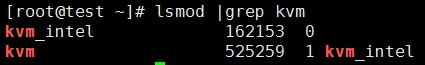

# 安装基础软件包

**安装虚拟机化相关软件**

在制作镜像的的时候，我们将要在节点A上**嵌套地**启动一个虚拟机。

1. 使用如下命令确认节点A的 CPU 是否支持 KVM 虚拟化

``` # egrep -c  "(vmx|svm)" /proc/cpuinfo  ``` 

<u>输出 0 表示不支持，非0 为支持。</u>

2. 确认kvm 模块已加载

``` # lsmod | grep  kvm   # 查看是否加载kvm内核模块```



 

3. 确认节点A上libvirtd 进程处于运行状态。

**安装Oz 工具及依赖包**

```
# yum install epel-release
# yum makecache
# yum install oz  
```

OZ安装完后:

1. kickstart文件所在目录:  /usr/lib/python2.7/site-packages/oz/auto 
2. tdl文件模板所在目录： /usr/share/doc/oz-0.15.0/examples 

安装虚拟机机启动工具

```# yum install qemu-system-x86  #安装此工具，稍后用于自验制作的镜像是否能启动```