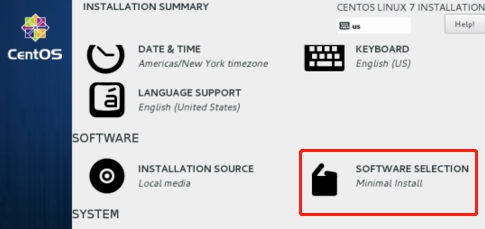

# Host 节点环境

**操作系统准备**

本次制作镜像的HOST 机器是在VMware上建立的一个虚拟机。安装虚拟机用到的镜像版本为：CentOS-7-x86_64-DVD-1708.iso。省略HOST 虚拟机安装步骤。

Note：安装虚拟机时，点击”SOFTWARE SELECTION”, 选择 Vitalization Host 后，系统会自动配好KVM相关的虚拟机化软件，以便支持嵌套虚拟机化。

 

该制作环境称为节点A。

**确认磁盘空间**

确保节点A的磁盘剩余空间约5G

**配置节点yum 源**

配置节点的yum 源为阿里或清华的源