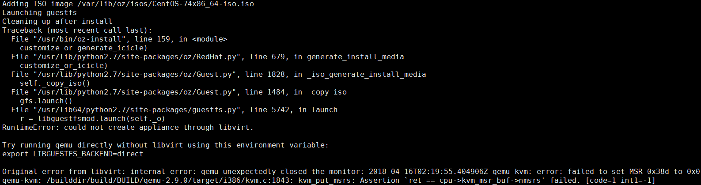
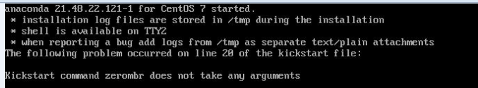

# 遇到的问题

**问题一**

运行```oz install```命令时，出现qemu 运行失败的问题



没找到有效的解决办法，直接重换节点A的系统镜像，即选择了CentOS-7-x86_64-DVD-1708.iso。


**问题二：**

虚拟机初始化后，安装系统或包的过程中出现问题


这个阶段出现问题一般是ks 文件出错了，错误中提示查看后缀为ppm 的文件。 该文件是一个图片，需把改文件转换为jpg 格式后，才能查看到具体原因。上图转换后打开后如下:



即错误原因为ks 文件中的```zerombr ```命令不需要任何参数，而我开始传参了（这估计和具体的oz 版本有关系）

*附图片格式转化代码*：

```
#coding=utf-8 

from PIL import Image
import os

path="/var/lib/oz/screenshots"
for file in os.listdir(path):
   img = Image.open(path+"/"+file)
   name = os.path.splitext(file)[0]
   file_name = name +".jpg"
   img.save(file_name)
```


**问题三：**

启动制作的镜像中，其中遇到cloud-init需要从默认的datasource 获取Metadata 数据。由于网络问题， 每次获取都失败，导致cloud-init 会反复尝试多个地址，这一过程，比较耗时（大约3分钟），但整体不影响虚拟机启动起来。


类似现状及解决办法： http://xcodest.me/cloud-init-cause-vm-boot-slow.html。