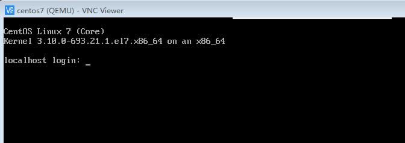

# 验证镜像

镜像创建完成后，镜像会保存在/var/lib/libvirt/images/下。我们可以通过以下命令先在节点A尝试启动镜像，验证制作是否成功。启动前，先备份镜像，并且使用qemu-system-x86_64 启动竟像时，需要在本地配置VNC viewer client 及在节点A配置VNC server。

```qemu-system-x86_64 -m 1024 -enable-kvm centos7_x86_64.qcow2  --vnc :1```

虚拟机启动初始化完成以后，进入登录界面。第一次登录默认用户名/密码为在ks 文件中定义的centos/changeme.

运行截图如下：